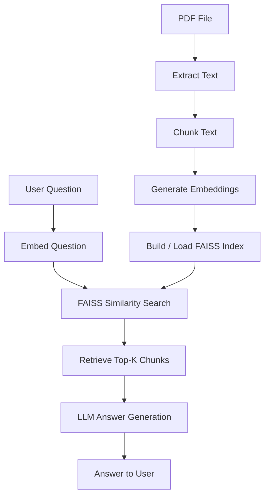

# PDF Question Answering with FAISS‑Based RAG (CLI)

This project is an **optimized command‑line PDF Question Answering system** built using a **Retrieval‑Augmented Generation (RAG)** architecture. It efficiently processes PDF documents by splitting them into chunks, storing embeddings in a **FAISS vector database**, and retrieving only the most relevant chunks at query time.

Unlike naïve approaches that feed the entire PDF to the language model, this implementation uses **chunking + similarity search**, making it scalable and efficient for larger documents.

---

## Project Structure

```
AI-Task-02/
│
├── main.py              # FAISS‑based RAG CLI application
├── example.pdf          # Sample PDF file
├── .env                 # Stores OPENAI_API_KEY (NOT committed)
├── .env.example         # Environment variable template
├── .gitignore           # Git ignore rules
├── .rag_cache/          # Cached FAISS index and metadata (auto‑generated)
└── README.md            # Project documentation
```

---

## 1. Setup Guide

### Prerequisites

* Python 3.10 or higher
* OpenAI API key
* pip (Python package manager)

---

### Installation Steps

#### 1. Clone the repository

```
git clone https://github.com/yourusername/pdf-rag-faiss-cli.git
cd pdf-rag-faiss-cli
```

---

#### 2. (Optional) Create and activate a virtual environment

```
python -m venv venv
```

**Windows**

```
venv\Scripts\activate
```

**macOS / Linux**

```
source venv/bin/activate
```

---

#### 3. Install dependencies

```
pip install openai python-dotenv pypdf numpy faiss-cpu
```

---

#### 4. Configure OpenAI API key

Create a `.env` file in the project root:

```
OPENAI_API_KEY=sk-proj-xxxxxxxxxxxxxxxxxxxxxxxxxxxxxxxxxxxxxxxx
```

**Important notes:**

* Do **not** use quotes around the key
* Ensure `.env` is listed in `.gitignore`
* Rotate the key if it was ever exposed

---

#### 5. Run the application

```
python main.py "C:\\full\\path\\to\\your\\pdf\\file.pdf"
```

Example:

```
python main.py "C:\\Users\\sanut\\OneDrive\\Documents\\AIGENX\\ai tasks\\AI-Task-02\\example.pdf"
```

---

## 2. How the System Works

This application follows a standard **RAG pipeline with vector storage**:

1. The PDF is read and text is extracted from all pages.
2. Text is split into overlapping chunks.
3. Each chunk is embedded using OpenAI embeddings.
4. Chunk embeddings are stored in a **FAISS vector index**.
5. The FAISS index and chunk metadata are cached to disk.
6. User questions are embedded and searched against the FAISS index.
7. Top‑K most similar chunks are retrieved.
8. A GPT model generates an answer **strictly from the retrieved chunks**.

If the answer is not present in the PDF, the system explicitly reports that it does not know.

---

## 3. Key Components and Logic

| Component         | Purpose                                  |
| ----------------- | ---------------------------------------- |
| `pypdf`           | Extracts text from PDF pages             |
| Text Chunking     | Prevents feeding entire PDF to the model |
| OpenAI Embeddings | Converts text chunks into vectors        |
| FAISS             | Efficient vector similarity search       |
| Similarity Search | Retrieves relevant chunks only           |
| GPT Model         | Generates grounded answers               |
| Cache Layer       | Avoids recomputing embeddings on reruns  |

---

## 4. Application Flow



---

## 5. Caching Behavior

* On **first run** with a PDF:

  * Chunks are embedded
  * FAISS index is created
  * Index and metadata are saved to `.rag_cache/`

* On **subsequent runs** with the same PDF:

  * FAISS index is loaded from disk
  * Embedding step is skipped
  * Startup time is significantly faster

---

## 6. Limitations

* Single‑PDF ingestion per run
* CLI‑only interface
* No OCR support for scanned PDFs
* Exact FAISS search (not approximate)

---

## 7. Future Improvements

* Multi‑PDF ingestion and unified index
* Page‑number citations in answers
* Approximate FAISS indexes (IVF / HNSW) for very large corpora
* OCR support for scanned documents
* Web UI using Flask or Streamlit
* REST API for integration with other systems

---

## Security Notes

* Never commit `.env` files
* Keep `.rag_cache/` out of Git
* Rotate API keys if exposed

---

## License

This project is intended for educational and experimental use.
